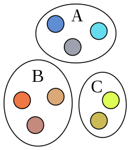
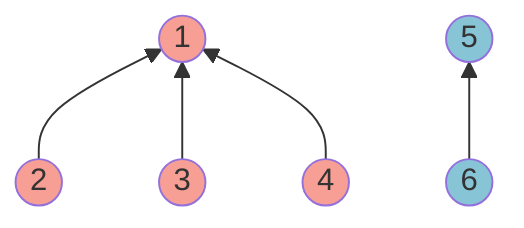
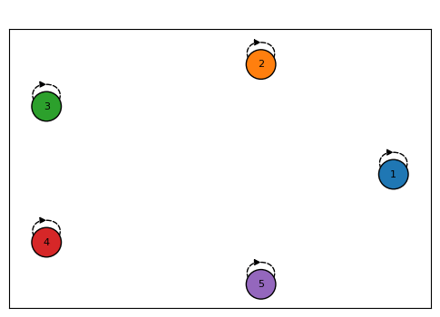

# Disjoint Set and Union-find

## Disjoint Set in Math

{ align=right }

서로소 집합(Disjoint Set)이란 집합 간에 상호 배타적인 집합들을 말한다[^1]. 예를 들면, 우측 그림과 같이 A, B와 C의 집합에서 서로 같은색이 하나도 없는 것이며, 이를 서로소 집합이라고 한다. 수식으로 다음과 같이 표현할 수 있다. 

$$A_i \cap A_j = \emptyset \quad \forall i, j \text{ where } i \neq j $$

## Disjoint Set in Data structure

컴퓨터 과학에서 disjoint set 자료 구조(union-find 자료 구조 또는 merge-find 자료 구조)는 서로소 집합을 저장하는 데이터 구조이다[^2]. 초기화하는 `make_set`, 찾기인 `find` 그리고 병합인 `union`으로 총 3 개의 연산을 수행한다.

* `make_set(x)`: `x`를 유일한 원소로 하는 새로운 집합을 만든다.
* `find(x)`: `x`가 속한 집합의 대표 값(루트 노드 값)을 반환한다.
* `union(x, y)`: `x`가 속한 집합과 `y`가 속한 집합을 합친다.

### Implementation

부모 노드의 위치만 알면 됨으로, parent의 구현은 실제 트리가 아닌 dictionary로 만들었다. `union`의 경우, 만약 같은 부모 루트가 아니라면, 항상 `y` 노드의 루트 노드를 `x` 노드의 루트로 바꾼다. 

```py linenums="1"
class DisjointSet():
    """DisjointSet"""
    def __init__(self) -> None:
        self.parent = {}

    def make_set(self, x: List[int]):
        for node in x:
            self.parent[node] = node
    
    def find(self, x: int):
        if x == self.parent[x]:
            return x
        
        return self.find(self.parent[x])

    def union(self, x: int, y: int):
        x_parent = self.find(x)
        y_parent = self.find(y)
        if x_parent == y_parent:
            return
        self.parent[y_parent] = x_parent
```

예를 들어, 아래 그림과 같이 3개의 트리로 구성된 disjoint set을 구현해보자. 



위 그래프에 따른 연산을 수행 시 disjoint set은 다음과 같다.

```py linenums="1"
x = [1, 2, 3, 4, 5, 6]
unions = [(1, 2), (2, 3), (2, 4), (5, 6)]

dis_set = DisjointSet()
dis_set.make_set(x)
for u, v in unions:
    # v 노드의 루트 노드가 u 노드의 루트 노드로 됨 
    dis_set.union(u, v)
```


### Path Compression

`find` 함수에서 각 노드가 최종 루트 노드만 가르키면 되기 때문에, 연결 리스트와 같은 트리의 경우 비효율적이다. 예를 들어 $5 \rightarrow 4 \rightarrow 3 \rightarrow 2 \rightarrow 1$ 인 연결 리스트(트리)에서 disjoint set(1개)을 만들려면, 다음과 같다.

```py linenums="1"
x = [1, 2, 3, 4, 5]
unions = [(4, 5), (3, 4), (2, 3), (1, 2)]
# 5 > 4 > 3 > 2 > 1
dis_set = DisjointSet()
dis_set.make_set(x)
for u, v in unions:
    dis_set.union(u, v)
```


결국에는 처음 끝까지 연결되어 있기 때문에, `find(5)` 일 때 모든 자식 노드를 거쳐서 `5`를 찾아야한다. 이를 방지하기 위해서 `find` 함수를 거치면서 각 자식 노드들이 본래의 루트 노드와 직접 연결하게 만드는 과정을 **Path Compression** 이라고 한다. 코드로 다음과 같이 find 부분을 수정한다.

```py linenums="1" hl_lines="5"
def find(self, x: int):
    if x == self.parent[x]:
        return x
    # path compression
    self.parent[x] = self.find(self.parent[x])
    
    return self.parent[x]
```

그리고 `union` 수행 후, 앞으로 `find` 함수로 호출하면 해당 경로에 있는 경로는 압축이 된다. 위 수정된 `find` 코드 에서 5번 라인 재귀 함수를 루트 노드 까지 호출 한 다음에 재귀를 빠져나오면서 루트가 수정이 된다. 예를 들어 `find(5)`를 수행하면 다음과 같다.

```py
dis_set.find(5)
```




### Rank Compression

Rank Compression은 두 트리를 합병 할 때, 항상 높이가 더 낮은 트리를 높은 트리 밑에 넣는 방법이다. 기존의 코드를 수정하면 다음과 같다.

=== "\_\_init\_\_"

    rank 저장할 공간을 dictionary로 구성한다.

    ```py linenums="1" hl_lines="3"
        def __init__(self) -> None:
            self.parent = {}
            self.rank = {}
    ```

=== "make_set"

    rank 저장할 공간을 초기화 한다.

    ```py linenums="1" hl_lines="4"
    def make_set(self, x: List[int]):
        for node in x:
            self.parent[node] = node
            self.rank[node] = 0
    ```

=== "union"

    항상 rank가 낮은 트리는 높은 트리의 root로 합병된다. 그렇지 않으면 기존대로 `x`의 루트로 합병되며, rank가 같은 경우에는 `x` 루트만 하나 상승시킨다.

    ```py linenums="1" hl_lines="9 10 11 12 13 14"
        def union(self, x: int, y: int):
            x_parent = self.find(x)
            y_parent = self.find(y)
            
            if x_parent == y_parent:
                return

            # rank compression
            if self.rank[x_parent] < self.rank[y_parent]:
                self.parent[x_parent] = y_parent
            else:
                self.parent[y_parent] = x_parent
                if self.rank[x_parent] == self.rank[y_parent]:
                    self.rank[x_parent] += 1
    ```

Rank compression 이후에 자동으로 union시 하나의 루트 노드만 가르키게 된다.


### Why using tree structure?

Disjoint set 자료구조를 트리로 구현하는 이유는 배열로 구현 할 경우, `union` 에서 배열의 모든 원소를 순회하면서 바꿔줘야 한다는 단점이 있다(`union`: $O(N)$, `find`: $O(1)$). 반면 rank compression된 트리로 구현 시, `union` 은 루트 노드를 찾아서 다르면 합치기만 하면 되서, `find` 연산에 전적으로 의존하게 된다. 트리의 높이에 의해 결정되고, 최악의 경우 $O(\log N)$ 이 되서, 향상된 성능을 낼 수가 있다[^2][^4][^5].  

* python에서는 dictionary(`#!python dict`) 자료 구조로 진행했지만 트리 클래스를 직접 만들어서 구현해 볼 수도 있을 것이다.


[^1]: [Disjoint sets](https://en.wikipedia.org/wiki/Disjoint_sets)
[^2]: [Disjoint-set data structure](https://en.wikipedia.org/wiki/Disjoint-set_data_structure)
[^3]: [Disjoint Set & Union-find](https://www.secmem.org/blog/2021/03/21/Disjoint-Set-Union-find/)
[^4]: [gmlwjd9405 - Union-Find 알고리즘](https://gmlwjd9405.github.io/2018/08/31/algorithm-union-find.html)
[^5]: [bowbowbow - Union-Find: Disjoint Set의 표현](https://bowbowbow.tistory.com/26)
