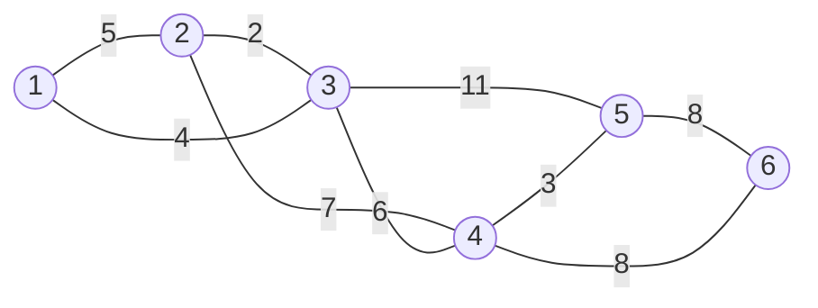
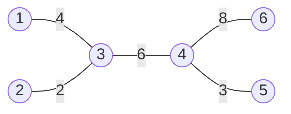
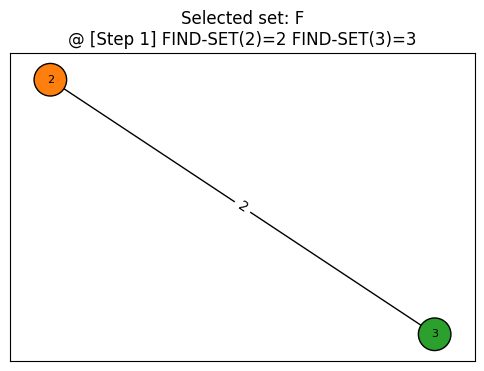
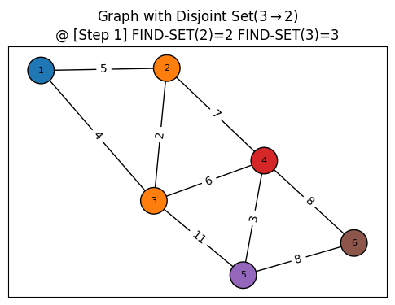

# Steiner Tree Problem

Steiner tree problem 혹은 minimum Steiner tree problem은 조합의 최적화 문제의 한 종류를 말한다[^1]. 여러 설정이 있지만, 보통은 그래프에서 정의하는 최소 스패닝 트리(minimum spanning tree, MST) 문제를 자주 사용한다.

## Problem Definition: Minimum Spanning Tree

최소 스패닝 트리(Minimum Spanning Tree, MST)[^2]는 그래프 내에서 모든 점(vertices)를 가능한 최소 총 간선(edge) 가중치로 연결하는 무방향 그래프의 부분 집합이다. 예를 들어 다음과 같은 그래프 $G(V=6, E=9)$ 에서, 



최소 스패닝 트리는 다음과 같다.



## Algorithms

탐욕적인(greedy) 방법을 사용하여 네트워크의 모든 정점을 최소 비용으로 연결하는 최적 해답을 구하는 **Kruskal**과 **Prim** 알고리즘이 있다.

### Kruskal

MST의 조건 (1) 최소 비용을 가지는 edge로 모든 노드가 연결되고 (2) 무방향 비순환(nondirect acyclic) 에 맞춰 최소 비용을 가지는 edge를 매 스탭에서 선택하게 된다. Union-find 자료구조를 사용하여 같은 서로소 집합이 아닌 경우에 edge를 선택하고, 사이클 형성 여부를 확인한다.

!!! cite "Pseudocode[^3]" 

    ```linenums="1" hl_lines="8"
    algorithm Kruskal(G) is
        F:= ∅
        for each v ∈ G.V do
            MAKE-SET(v)
        for each (u, v) in G.E ordered by weight(u, v), increasing do
            if FIND-SET(u) ≠ FIND-SET(v) then
                F:= F ∪ {(u, v)} ∪ {(v, u)}
                UNION(FIND-SET(u), FIND-SET(v))
        return F
    ```

    * Disjoint Set 자료구조는 [Disjoint Set and Union-find](./08-28-disjointset.md) 글을 참고
    * 8번 라인의 코드에서 사이클 형성 여부를 확인한다.

코드로 구현하면 다음과 같다.

```py linenums="1"
def Kruskal(G: nx.Graph):
    """
    algorithm Kruskal(G) is
        F:= ∅
        for each v ∈ G.V do
            MAKE-SET(v)
        for each (u, v) in G.E ordered by weight(u, v), increasing do
            if FIND-SET(u) ≠ FIND-SET(v) then
                F:= F U {(u, v)} U {(v, u)}
                UNION(FIND-SET(u), FIND-SET(v))
        return F
    """
    F = set()
    disjoint_set = DisjointSet()
    disjoint_set.make_set(G.nodes())  # MAKE-SET

    # Sort edges & weights in ascending order
    edges_weights = nx.get_edge_attributes(G, 'weight')  # return as Dict[tuple, int]
    sorted_edges_weights = sorted(edges_weights.items(), key=lambda x: x[1], reverse=False)
    
    # Union-Find Algorithm 
    for (u, v), w in sorted_edges_weights:
        if disjoint_set.find(u) != disjoint_set.find(v):
            F = F.union({(u, v, w)}).union({(v, u, w)})
            disjoint_set.union(u, v)

            # +) Spanning Tree 정의상 최대 N-1개의 edge가 있으므로 
            # 해당 조건에 맞춰 break 걸 수도 있다.
    return F, disjoint_set
```

구현한 코드의 결과를 보면 다음과 같이 최소 비용으로 연결하는 edge들을 찾아낸다. 아래 그림은 Union-Find 알고리즘에서 각 스텝 별로 최소 비용을 담는 edge들의 집합 `F`가 어떻게 결합이 되는지 알 수 있다.



아래 그림은 Union-Find 알고리즘에서 각 스텝 별로 disjoint set 가 어떻게 결합이 되여 사이클의 형성 여부를 확인 할 수 있다.



### Prim

시작 vertex을 선택한 후에 인접한 edges중 최소 비용을 가지는 edge를 연결된 vertex를 지속적으로 선택하는 알고리즘이다.

[^1]: [Wikipedia - Steiner tree problem](https://en.wikipedia.org/wiki/Steiner_tree_problem)
[^2]: [Minimum spanning tree](https://en.wikipedia.org/wiki/Minimum_spanning_tree)
[^3]: [Kruskal's algorithm](https://en.wikipedia.org/wiki/Kruskal%27s_algorithm)
[^4]: [Prim's algorithm](https://en.wikipedia.org/wiki/Prim%27s_algorithm)
[^8]: [슈타이너 트리 2-근사 알고리즘](https://gazelle-and-cs.tistory.com/65)